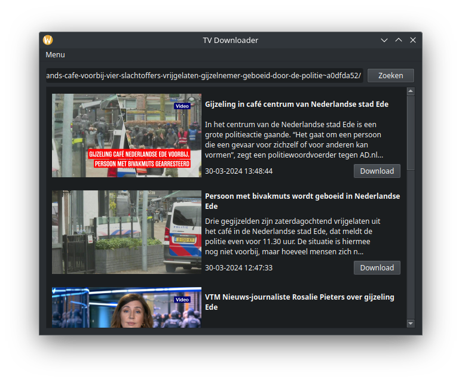

# TV Downloader

Tv Downloader is een tool om video's van verschillende websites te downloaden.



## Ondersteunde websites

| Website | Ondersteund |
| ------- | --------- |
|[bruzz.be](https://bruzz.be)|✅|
|[focus-wtv.be](https://focus-wtv.be)|✅|
|[gva.be](https://gva.be)|✅|
|[hln.be](https://hln.be)|✅|
|[nieuwsblad.be](https://nieuwsblad.be)|✅|
|[ringtv.be](https://ringtv.be)|✅|
|[robtv.be](https://robtv.be)|✅|
|[rtv.be](https://rtv.be)|✅|
|[standaard.be](https://standaard.be)|✅|
|[tvoost.be](https://tvoost.be)|✅|
|[tvl.be](https://tvl.be)|✅|
|[vrtnws.be](https://vrtnws.be)|✅|
|[vrtmax.be](https://vrtmax.be)|✅|
|[nwsnwsnws.be](https://nwsnwsnws.be)|✅|

## Installatie

| OS | ARCH | Download | Build Status |
| -- | ---- | -------- | ------------ |
| Linux | x86_64 | [tvdownloader-linux-x86_64](https://github.com/quintenvandamme/tv_downloader/releases/download/continious-build/tvdownloader-Linux-x86_64) | [](https://github.com/quintenvandamme/tv_downloader/actions/workflows/build.yml) |s
| Linux | x86_64 | [tvdownloader-linux-x86_64.AppImage](https://github.com/quintenvandamme/tv_downloader/releases/download/continious-build/tvdownloader-Linux-x86_64.AppImage) | [](https://github.com/quintenvandamme/tv_downloader/actions/workflows/build.yml) |
| Windows | x86_64 | [tvdownloader-win32-x86_64.exe](https://github.com/quintenvandamme/tv_downloader/releases/download/continious-build/tvdownloader-win32-x86_64.exe) |[](https://github.com/quintenvandamme/tv_downloader/actions/workflows/build.yml)|

## Bouwen

```sh
python build.py build
```
